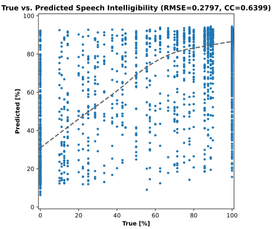
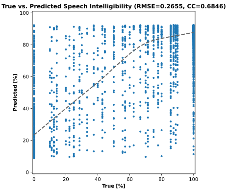

# Speech Intelligibility Prediction with Neural Networks

This repository contains code for predicting speech intelligibility using deep learning models based on the Clarity Prediction Challenge ([CPC1](https://claritychallenge.org/docs/cpc1/cpc1_intro)) dataset.

This work was part of a B\.Sc. thesis that aimed to investigate and develop neural networks for speech intelligibility prediction, evaluating their effectiveness against traditional intrusive objective metrics such as STOI[^1].

---

## How to Use

### Installation

Clone the repository:

```bash
git clone https://github.com/George-P-1/Speech_Intelligibility_with_Neural_Networks.git
cd Speech_Intelligibility_with_Neural_Networks
```

### Prerequisites

See *requirements.txt* for the necessary dependencies.
To install the necessary dependencies, run:

```bash
pip install -r requirements.txt
```

---

## Overview

The project focuses on utilizing neural networks to predict how intelligible speech is to human listeners, especially in noisy environments. Two major approaches were explored:

1. **D-matrix Representations from STOI**: Internal representations (d-matrices) derived from the STOI metric were used as input to various deep learning models to improve speech intelligibility prediction. The implementation and results of the STOI metric is available [here](https://github.com/George-P-1/stoi_Metric).
    - **Multilayer Perceptron (MLP)**: A simple deep feedforward neural network for prediction based on d-matrix features.
        <div align="center">
            
        </div>
    - **Gated Recurrent Units (GRU)**: A recurrent neural network model designed to capture sequential dependencies in speech intelligibility.
        <div align="center">
            
        </div>
2. **Spectrogram and Cochleogram Representations**: Features extracted from spectrograms and cochleograms were processed by Convolutional Neural Networks (CNNs) for intelligibility prediction.

This repository focuses mainly on the first approach (D-matrix representations for prediction), which was carried out by **George Punnoose**. The code related to **Emin Shirinov**'s work on spectrogram and cochleogram-based prediction using CNNs is available in his own [fork](https://github.com/Codeexia0/Speech_Intelligibility_with_Neural_Networks) of the repository.

The dataset used is the [CPC1 dataset](https://claritychallenge.org/docs/cpc1/cpc1_download), which includes noisy speech signals and corresponding intelligibility scores.

---

## Experimentation

The models were trained and evaluated on the CPC1 dataset, and various hyperparameters and architectural configurations were tested to optimize performance. A key observation was that **GRU models** outperformed **MLP models**, achieving better results for speech intelligibility prediction.

### MLP Model Results

Implementation for MLP in [nn-stoi-inp](https://github.com/George-P-1/Speech_Intelligibility_with_Neural_Networks/tree/nn-stoi-inp) branch.

<div align="center">
    
    
</div>


### GRU Model Results

Implementation for GRU in [gru-stoi-inp](https://github.com/George-P-1/Speech_Intelligibility_with_Neural_Networks/tree/gru-stoi-inp) branch.

<div align="center">
  
  
</div>


<!-- ### CNN1d Model Results -->

#### Visualizing Results

Scatter plots and histograms are used for visualizing model performance. The scatter plots, in particular, compare predicted intelligibility scores with true human scores, showing the relationship between them.

They can be plotted using the `plot_results.ipynb` script. To use it, provide a CSV file containing **true and predicted values**.

---

## Conclusion of the Thesis
Through experimentation, we compared these networks’ performances using RMSE and CC, demonstrating that deep-learning-based models can outperform traditional methods in intelligibility prediction tasks.

The success of deep learning models can be attributed to their ability to leverage spectral features, d-matrix representations, and temporal modeling. 
CNNs trained on spectrograms effectively captured speech intelligibility patterns by extracting spectral information that STOI could not fully utilize. The d-matrices provided structured representations time-frequency correlations between clean and noisy speech, enabling models to learn meaningful intelligibility patterns. The use of GRUs improved predictions by modeling temporal dependencies, allowing the network to track intelligibility changes over time.

---

## Further Work
- **Hybrid Models**: Future research should explore hybrid models combining CNNs with GRUs to leverage both spectral and temporal dependencies in speech intelligibility.
- **Transformer Models**: Investigating transformer-based models such as Whisper may provide better feature extraction and improve model performance.

<!-- ### License
This project is licensed under the MIT License - see the LICENSE file for details. -->

## Acknowledgements
The code and models here are based on the research and work of [George Punnoose](https://github.com/George-P-1) and [Emin Shirinov](https://github.com/Codeexia0). The dataset used in this work was provided by [The Clarity Project](https://claritychallenge.org).

[^1]: Cees H. Taal, Richard C. Hendriks, Richard Heusdens, and Jesper Jensen. “An Algorithm for Intelligibility Prediction of Time-Frequency Weighted Noisy Speech”. In: IEEE Transactions on Audio, Speech, and Language Processing 19.7 (Sept. 2011), pp. 2125–2136. doi: 10.1109/TASL.2011.2114881.